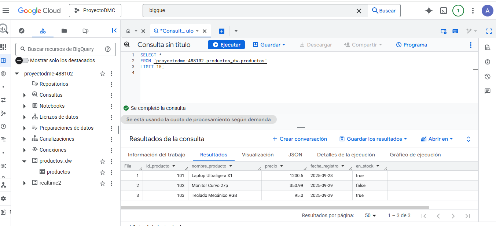

# 📦 GCP Retail Inventory DWH - Data Pipeline Automatizado

**Creado por:** Angel Teodoro Jaramillo Sulca  
**Rol:** Data Engineer  
**Contacto:** [LinkedIn](https://www.linkedin.com/in/angeljarads/) | [GitHub](https://github.com/Angeljs094)

---

## 📖 Contexto del Proyecto
La gestión de inventarios (productos, precios y stock) generaba archivos diarios en formato JSON almacenados de manera aislada en la nube. El equipo de analítica enfrentaba grandes desafíos para consultar estos archivos, y cargarlos manualmente en la base de datos transaccional (PostgreSQL) generaba cuellos de botella que degradaban el rendimiento de los sistemas operativos diarios. Además, los datos crudos presentaban inconsistencias en sus tipos de datos.

Este proyecto implementa una **arquitectura de datos automatizada y desacoplada**. Utiliza PostgreSQL exclusivamente como capa operativa temporal (Staging/ODS) y transfiere la carga analítica pesada a Google BigQuery, permitiendo consultas masivas eficientes sin impactar la operación principal.

---

## 🛠️ Stack Tecnológico
* **Lenguaje:** Python 3.11 (Pandas)
* **Orquestación:** Apache Airflow (Cloud Composer)
* **Google Cloud Platform (GCP):**
  * **Data Lake (Bronze):** Google Cloud Storage (GCS)
  * **Data Warehouse (Gold):** Google BigQuery
* **Bases de Datos Relacionales:** PostgreSQL

---

## 🏗️ Arquitectura y Flujo de Datos
El pipeline fue diseñado como código (DAG) garantizando un orden de ejecución estricto e idempotente:
1. **Extracción (GCS):** Descarga del archivo `data.json` automatizada desde el bucket de almacenamiento.
2. **Carga Operativa:** Inserción masiva de los registros crudos en la tabla transaccional de **PostgreSQL**.
3. **Transformación en Tránsito:** Extracción desde Postgres y normalización "al vuelo" usando **Pandas** (estandarización de fechas y validación de campos booleanos para el estado del stock).
4. **Carga Analítica:** Inserción final de los datos limpios en el dataset de **BigQuery**, listos para ser consumidos por herramientas de Business Intelligence (Power BI / Looker).

---

## 📊 Evidencias de Ejecución

### 1. Grafo del Pipeline (Apache Airflow)
El DAG (`gcs_json_to_postgres_load_final`) demuestra la secuencialidad lógica de las tareas: Creación de tablas $\rightarrow$ Carga a Postgres $\rightarrow$ Carga a BigQuery.

### 2. Resultados en BigQuery (Capa Gold)
Datos de inventario consolidados exitosamente, mostrando los registros tipificados correctamente (ej. valores booleanos en stock) y listos para análisis.

---

## 📁 Estructura del Repositorio
* `/Data`: Archivos JSON de muestra para replicar el flujo.
* `/Docs`: Documentación técnica e informes de ejecución del proyecto.
* `/Images`: Evidencias visuales de la orquestación y carga final.
* `/Scripts` (o `/dags`):
  * `dag_inventory_pipeline.py`: DAG principal de Apache Airflow.
  * `config.py`: Variables de entorno y conexiones.
  * `etl_tasks.py`: Funciones modulares de extracción y transformación con Pandas.
* `requirements.txt`: Dependencias del entorno de Python.